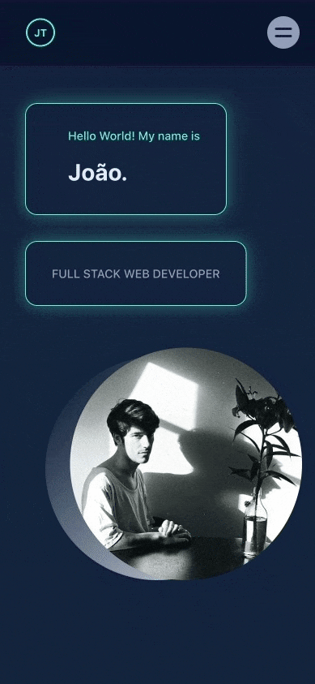
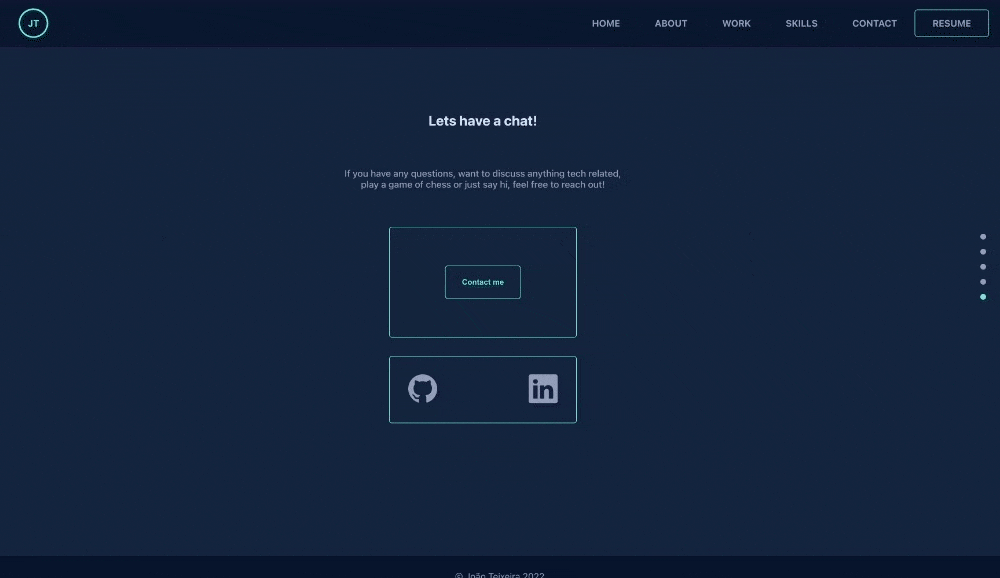

# Portfolio

## Live Website

https://www.joaoteixeira.dev/

## Overview

A single-page application website built with TypeScript and React where I showcase some of my work as a developer. Visitors can check the GitHub repository of each individual work by clicking on its correspondent image.

## Technology

-   
 <a href="https://www.typescriptlang.org/" target="_blank">    &nbsp; 

-   TypeScript, React.js

## Features

-   **Navigation bar**
     
    On the desktop version, users can scroll directly to a specific website section or see my CV directly from the navigation bar.

-   **Works**
     
    Users can see some of my works, and filter them by associated tags. GitHub repositories are linked to each work's image.

-   **Contact**
     
    Users can write me or follow me in social media on the contact form.

-   **Mobile**
     
    Application is responsive across different screen sizes including mobile devices.

## Preview

**_General_**

 
 

**_Navigation Bar_**

 
 

**_Navigation dots and social media icons_**

 
 

**_Mobile_**
 

 
 

**_Work section_**

 
 

**_Contact form_**

